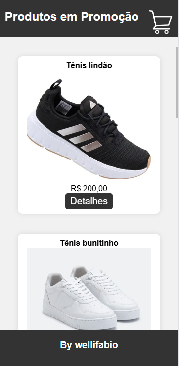
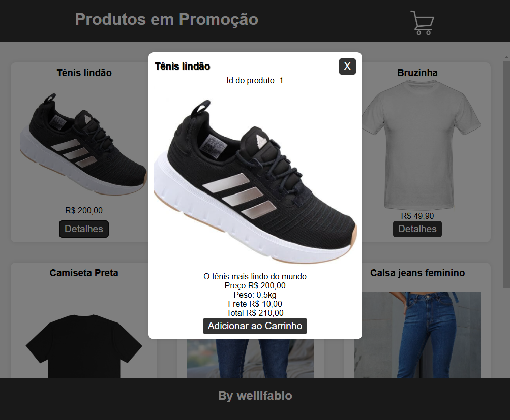
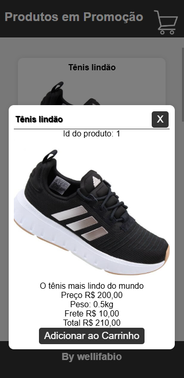
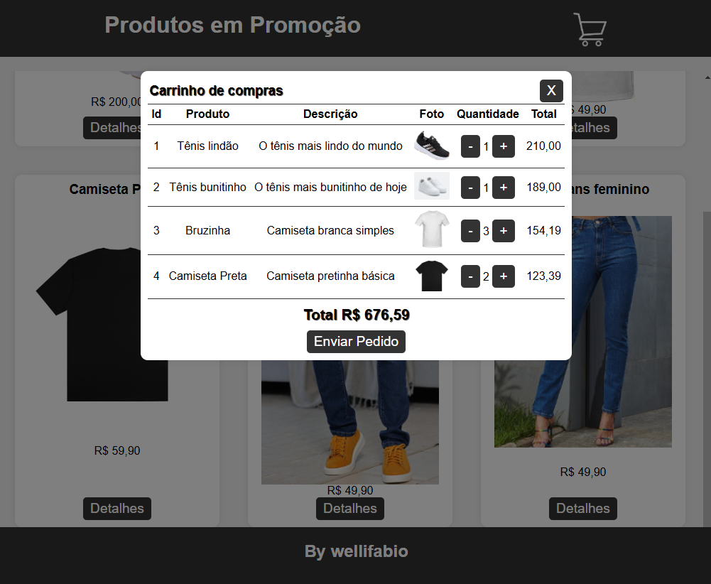
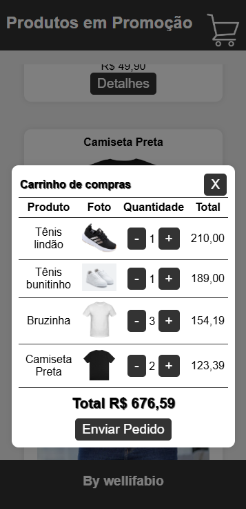
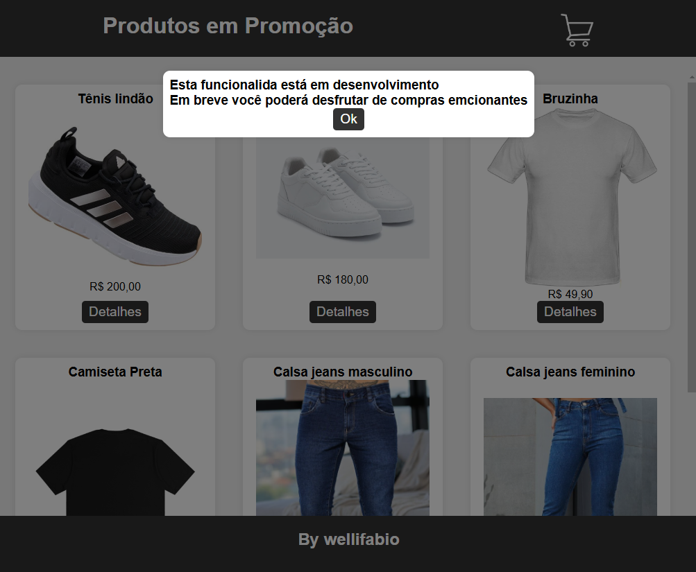
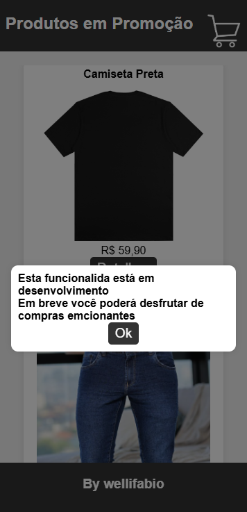

# Cards e Carrinho de Compras [Front-end]
Exemplo de aplicativo web front-end, que lista dados de um vetor JSON e renderiza em forma de **Cards**, mostra os detalhes de cada produto em um **modal**, melhora a UX (User experience) exibindo mensagens em um modal ao inves de alert(). E por fim, adiciona produtos ao carrinho de compras, exibindo a quantidade de itens e o valor total, perminindo a remoção de itens do carrinho e alteração da quantidade de itens.

## Requisitos
- [VsCode](https://code.visualstudio.com/)

## Instalação
1. Clone este repositório
2. Abra com o VsCode 
3. Execute o arquivo **index.html** no navegador ou via live server do VsCode.

## Wireframes
|Web|Responsivo|
|-|-|
|||
|||
|||
|||